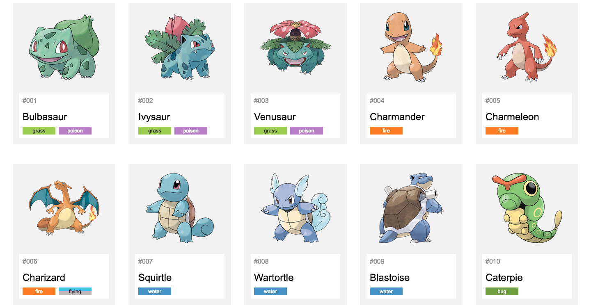
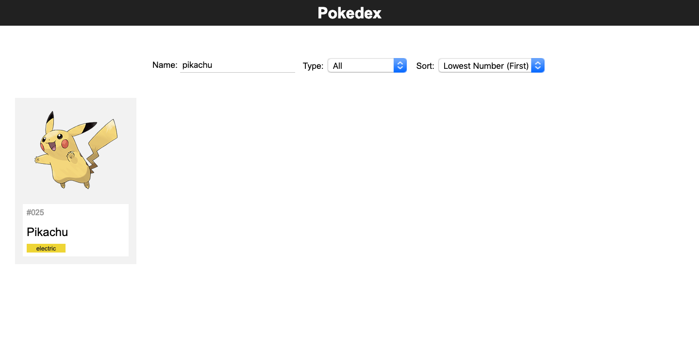
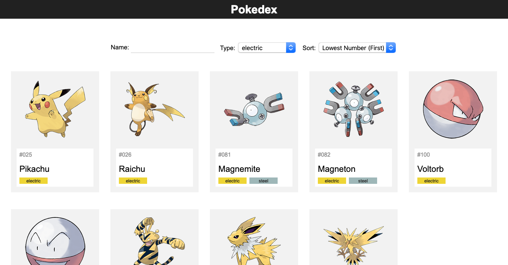
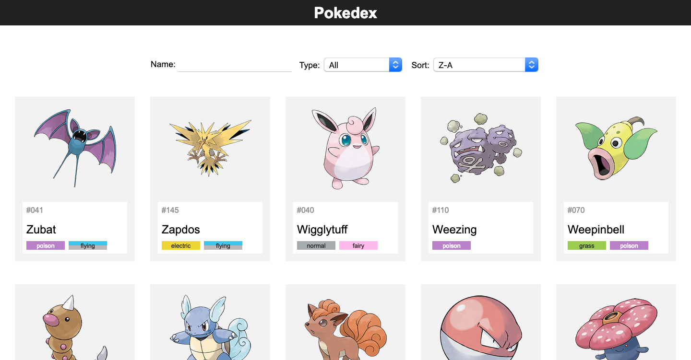
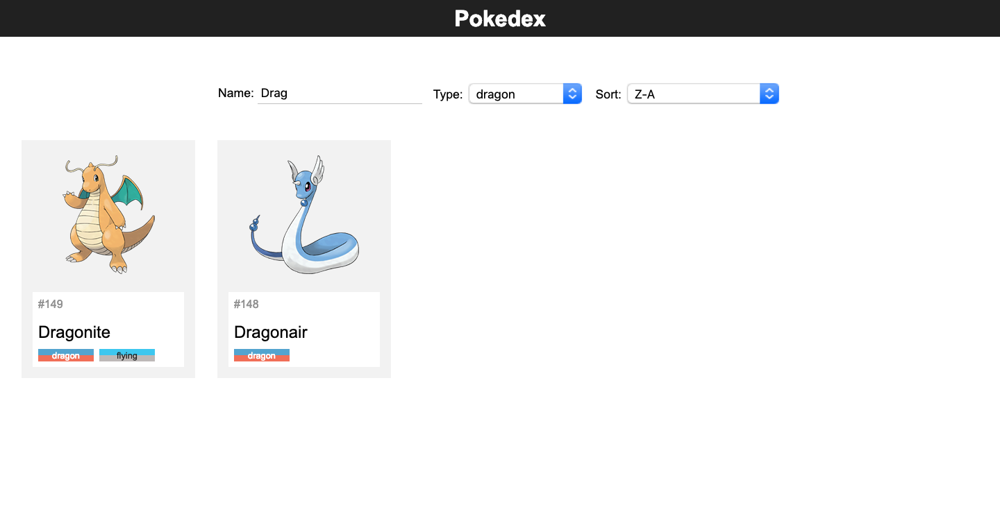

<h4 align="center">

Um desafio encontrado na internet da faculdade <u>IFPB — Instituto Federal da Paraiba </u>
</h4>

<h1>Desafio</h1>

COMPONENTE 1 - No arquivo JSON existe um Array de Pokemons que possui várias informação como id, nome, tipo e estatísticas:
Usando esses dados crie a Pokedex seguindo o padrão da imagem abaixo.

Também considere que o HTML necessário para compor esta Pokedex deve possuir uma estrutura como esta para o Pokemon Bulbasaur:

<textarea readonly rows='63' cols='40'>

  <figure class="pokemon-figure">
    
  </figure>
  <section class="pokemon-description">
    #001
    <h1 class="pokemon-name">Bulbasaur</h1>
    

      grass
      poison
    

  </section>
  <section class="pokemon-stats">
    

      
hp

      

        
45

      

    

    

      
attack

      

        
49

      

    

    

      
defense

      

        
49

      

    

    

      
sp-atk

      

        
65

      

    

    

      
sp-def

      

        
65

      

    

    

      
speed

      

        
45

      

    

  </section>

</textarea>

COMPONENTE 2 - Crie o filtro da Pokedex por nome para exibir os pokemon da Pokedex que possuirem o termo digitado em seu nome, caso contrário ele não será exibido. A imagem abaixo, por exemplo, lista na Pokedex os pokemons que possuem o nome pikachu.

COMPONENTE 3 - Crie o filtro da Pokedex por tipo para exibir apenas os pokemon de algum tipo específico. A imagem abaixo, por exemplo, lista na Pokedex apenas os pokemons que possuem o tipo eletric.

COMPONENTE 4 - Crie o ordenador da Pokedex para ajudar na listagem da Pokedex conforme a imagem abaixo.

COMPONENTE 5 - Faça que o formulário realize o filtro e ordenação de modo integrado, tal como a imagem abaixo.

## :rocket: Tecnologias

Esse projeto foi desenvolvido com as seguintes tecnologias:

-  [HTML]
-  [Javascript]
-  [CSS]
-  [VS Code]

##link:
https://ifpb.github.io/javascript-exercises/challenges/w3c/pokedex/